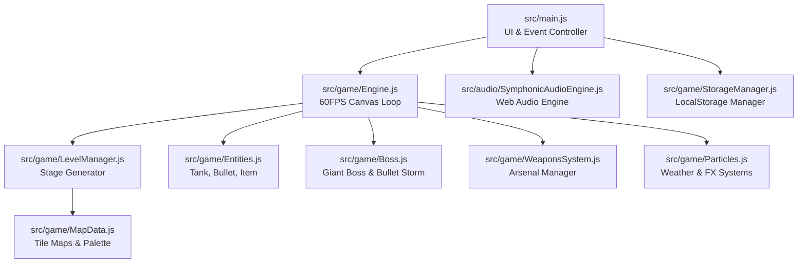
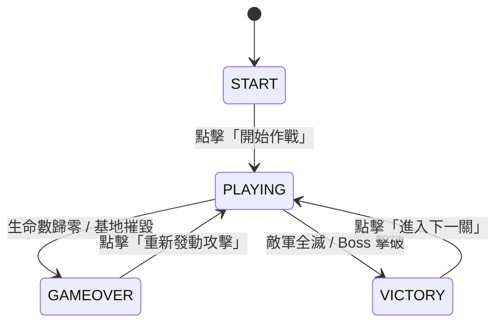

# 開發者交接手冊 (Developer Handover Guide)

歡迎接手《禹旭寶貝大作戰》(Yuk-Yuk Baby Battle / Tank Front 1988) 專案。本手冊旨在幫助新進開發者與維護人員快速掌握專案架構、核心數據流、渲染機制及二次開發擴充方法。

---

## 📐 1. 專案系統架構概覽 (Architecture Overview)

專案採用原生 JavaScript (ES6 Modules) + Canvas 2D + Web Audio API 構建，透過 Vite 進行模組化打包與開發。整體架構分為 UI/DOM 控制層、聲音引擎層與遊戲核心邏輯層。



---

## 🔄 2. 核心數據流與狀態生命週期 (Data Flow & State Lifecycle)

### 遊戲狀態遷移圖 (State Machine)
- `START`：初始選單狀態，等待玩家啟動遊戲或開啟關卡選擇器。
- `PLAYING`：主遊戲迴圈運作中，60FPS 更新實體位置、物理碰撞、粒子與畫布渲染。
- `GAMEOVER`：玩家或鷹徽基地摧毀，暫停 BGM、觸發超任戰報結算 UI。
- `VICTORY`：全滅敵軍或擊敗關卡 Boss，播放通關音效並解鎖下一關。



---

## 🗺️ 3. 地形與微觀撞擊系統 (SubMap Architecture)

地圖數據採用兩層式解析架構：
1. **大格地圖 (Map Grid)**：`13 × 13` 矩陣（`MAP_SIZE = 13`），定義關卡基本地形結構。
2. **微觀地圖 (SubMap Grid)**：`26 × 26` 矩陣（`SUB_MAP_SIZE = 26`），每大格切分為 4 個 `12px × 12px` 微觀小格。
   - **磚牆 (TILE.BRICK / `1`)**：可被普通子彈摧毀為 `0` (TILE.EMPTY)。
   - **鋼牆 (TILE.STEEL / `2`)**：僅能被雷射或強化穿牆彈摧毀。
   - **水路 (TILE.WATER / `3`)**：坦克不可穿越，子彈可越過。
   - **樹叢 (TILE.TREES / `4`)**：遮蔽坦克與子彈（於頂層 Overlay 渲染）。
   - **冰面 (TILE.ICE / `5`)**：滑行與加速打滑效果。
   - **鷹徽基地 (TILE.BASE / `6`)**：玩家保護標的。

---

## 🎨 4. 2.5D Mode 7 透視與天氣渲染 (Mode 7 & Weather Systems)

### Mode 7 傾斜透視 (Perspective Transform)
在 `Engine.js` 的 `render()` 函式中，透過 Canvas `transform` 仿射變換實現 SNES 懷舊傾斜視角：
```javascript
if (this.cameraPerspectiveMode === '2.5D') {
  // 水平切變與垂直壓縮，打造 2.5D 立體視角
  this.ctx.transform(1, 0, -0.05, 0.94, 16, 12);
}
```

### 夜間探照燈系統 (Night Flashlight Cutout)
當 `weatherMode === 'night'` 時，利用 `globalCompositeOperation = 'destination-out'` 的涇渭分明遮罩技術，在暗夜背景中隨玩家坦克座標繪製徑向漸層光圈。

---

## 🛠️ 5. 二次開發擴充指南 (Extension Tutorials)

### 範例 A：新增一種敵軍兵種 (New Enemy Tank)
1. 開啟 [src/game/Entities.js](file:///c:/Users/user/Documents/坦克大戰/src/game/Entities.js)。
2. 在 `EnemyTank` 建構式新增兵種屬性設定：
```javascript
if (enemyType === 'phantom') {
  this.hp = 2;
  this.speed = 2.0;
  this.color = '#aa00ff'; // 紫色幻影坦克
}
```
3. 在 [src/game/Engine.js](file:///c:/Users/user/Documents/坦克大戰/src/game/Engine.js) 的 `spawnTimer` 生成邏輯中，將 `'phantom'` 加入關卡敵軍池即可。

### 範例 B：新增一種合成音效 (New Web Audio SFX)
1. 開啟 [src/audio/SymphonicAudioEngine.js](file:///c:/Users/user/Documents/坦克大戰/src/audio/SymphonicAudioEngine.js)。
2. 在 `sfxList` 陣列註冊音效名稱。
3. 在 `playSfx(type)` 的 `switch` 分支中加入動態振盪器 (Oscillator) 邏輯：
```javascript
case "teleport_warp": {
  const osc = this.ctx.createOscillator();
  osc.type = "sine";
  osc.frequency.setValueAtTime(100, t);
  osc.frequency.exponentialRampToValueAtTime(1200, t + 0.3);
  g.gain.setValueAtTime(0.3, t);
  g.gain.exponentialRampToValueAtTime(0.01, t + 0.3);
  osc.connect(g);
  osc.start(t);
  osc.stop(t + 0.3);
  setTimeout(() => { osc.disconnect(); g.disconnect(); }, 350);
  break;
}
```

---

## 🔐 6. 交接點檢表 (Handover Checklist)

- [x] 所有原始碼無全域未擷取例外。
- [x] `npm run build` 打包通過零警告。
- [x] LocalStorage 防鎖死與離線 PWA 體驗測試完畢。
